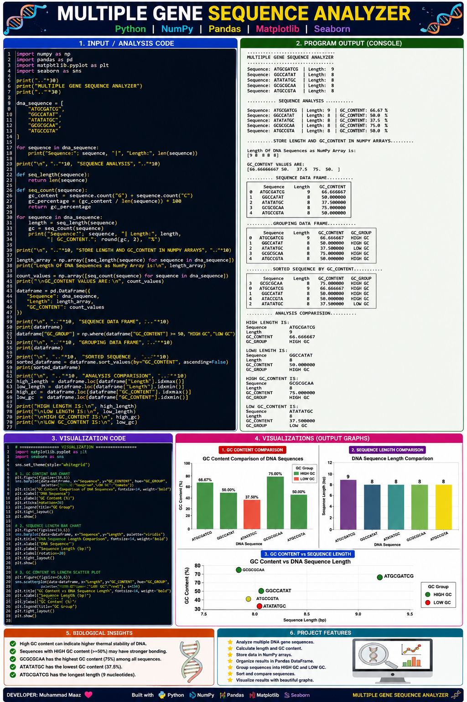

# 🧬 MULTIPLE GENE SEQUENCE ANALYZER

### 🔬 A Python-Based Computational Biology Project

**Multiple Gene Sequence Analyzer** is a Python-based computational biology project designed to analyze **multiple DNA sequences simultaneously**. The project calculates sequence length, GC content, classifies sequences into GC groups, sorts the results, performs comparative analysis, and generates professional visualizations.

This project demonstrates how **Python, NumPy, Pandas, Matplotlib, and Seaborn** can be combined to perform biological sequence analysis and data visualization.

---

## 🚀 PROJECT OVERVIEW

Analyzing multiple DNA sequences manually can become difficult when the number of sequences increases.

This project automates the analysis by taking multiple DNA sequences and calculating:

* 🧬 DNA sequence length
* 🧪 GC content percentage
* 📊 GC classification
* 🔢 NumPy-based numerical analysis
* 🗂️ Pandas DataFrame organization
* 🔽 GC-content-based sorting
* 📈 Highest and lowest sequence comparisons
* 📊 Data visualization
* 🔬 Biological interpretation

The project is designed as a beginner-to-intermediate **Computational Biology** project and demonstrates how biological data can be processed programmatically.

---

## 🎯 PROJECT OBJECTIVES

The main objectives of this project are:

1. Analyze multiple DNA sequences.
2. Calculate the length of each sequence.
3. Calculate GC content percentage.
4. Store numerical results using NumPy arrays.
5. Organize sequence information using Pandas.
6. Classify sequences into HIGH GC and LOW GC groups.
7. Sort sequences according to GC content.
8. Identify highest and lowest sequence lengths.
9. Identify highest and lowest GC content.
10. Visualize biological results using graphs.

---

## 🧬 DNA SEQUENCES USED

The project analyzes five example DNA sequences:

```text
ATGCGATCG
GGCCATAT
ATATATGC
GCGCGCAA
ATGCCGTA
```

Each sequence is analyzed independently and then combined into a single DataFrame for comparison.

---

## 🔬 ANALYSIS PERFORMED

### 1. Sequence Length

The project calculates the number of nucleotides present in each DNA sequence.

Example:

```text
ATGCGATCG → 9 nucleotides
```

---

### 2. GC Content

GC content represents the percentage of **Guanine (G)** and **Cytosine (C)** nucleotides in a DNA sequence.

The formula used is:

```text
GC Content (%) =
(G + C) / Total Sequence Length × 100
```

For example:

```text
GCGCGCAA → 75% GC Content
```

---

### 3. GC Grouping

Sequences are classified using NumPy:

```python
np.where(
    dataframe["GC_CONTENT"] >= 50,
    "HIGH GC",
    "LOW GC"
)
```

The classification is:

```text
GC Content >= 50% → HIGH GC
GC Content < 50%  → LOW GC
```

---

## 📊 DATA ANALYSIS WITH NUMPY

NumPy arrays are used to store:

### Sequence Length

```python
length_array
```

### GC Content

```python
count_values
```

This allows biological measurements to be processed efficiently as numerical data.

---

## 🗂️ DATA ANALYSIS WITH PANDAS

The project creates a Pandas DataFrame containing:

| Column       | Description                     |
| ------------ | ------------------------------- |
| `Sequence`   | DNA sequence                    |
| `Length`     | Sequence length                 |
| `GC_CONTENT` | GC percentage                   |
| `GC_GROUP`   | HIGH GC / LOW GC classification |

The DataFrame is also sorted according to GC content.

---

## 📈 VISUALIZATION

The project includes **three major visualizations** using Matplotlib and Seaborn.

### 1. 🟢 GC Content Comparison

A bar chart compares the GC percentage of all DNA sequences.

It makes it easy to identify sequences with:

* Highest GC content
* Lowest GC content
* HIGH GC classification
* LOW GC classification

### 2. 🔵 DNA Sequence Length Comparison

A bar chart compares the length of each DNA sequence.

This allows quick identification of the longest and shortest sequences.

### 3. 🔴 GC Content vs Sequence Length

A scatter plot compares:

```text
Sequence Length
        ↓
GC Content
```

This provides a visual relationship between sequence length and GC content.

---

## 🖼️ PROJECT VISUALIZATION

The project includes a complete visualization poster containing:

**Input Code → Program Output → Visualization Code → Graphs → Biological Insights**



---

## 📋 SAMPLE ANALYSIS RESULTS

The example dataset produces results such as:

```text
Highest GC Content:
GCGCGCAA → 75%

Lowest GC Content:
ATATATGC → 37.5%

Longest Sequence:
ATGCGATCG → 9 nucleotides
```

The remaining sequences are compared automatically through the Pandas DataFrame.

---

## 🛠️ TECHNOLOGIES USED

| Technology    | Purpose                                       |
| ------------- | --------------------------------------------- |
| 🐍 Python     | Core programming language                     |
| 🔢 NumPy      | Numerical and array-based analysis            |
| 🐼 Pandas     | DataFrame and data manipulation               |
| 📊 Matplotlib | Data visualization                            |
| 🎨 Seaborn    | Statistical and biological data visualization |

---

## 📦 INSTALLATION

Clone the repository:

```bash
git clone YOUR_REPOSITORY_URL
```

Move into the project directory:

```bash
cd Multiple-Gene-Sequence-Analyzer
```

Install the required libraries:

```bash
pip install numpy pandas matplotlib seaborn
```

---

## ▶️ HOW TO RUN

Run the Python file:

```bash
python multiple_gene_sequence_analyzer.py
```

The program will:

```text
1. Load DNA sequences
2. Calculate sequence lengths
3. Calculate GC content
4. Create NumPy arrays
5. Create Pandas DataFrame
6. Classify GC groups
7. Sort sequences
8. Compare highest and lowest values
9. Display visualizations
```

---

## 📂 PROJECT STRUCTURE

```text
Multiple-Gene-Sequence-Analyzer/
│
├── multiple_gene_sequence_analyzer.py
│
├── MULTIPLE_GENE_SEQUENCE_ANALYZER_VIP.png
│
├── requirements.txt
│
└── README.md
```

---

## 📄 REQUIREMENTS

Create a `requirements.txt` file containing:

```text
numpy
pandas
matplotlib
seaborn
```

Install everything with:

```bash
pip install -r requirements.txt
```

---

## 🔬 BIOLOGICAL INSIGHTS

GC content is an important characteristic of DNA sequence composition.

In this example dataset:

* **GCGCGCAA** has the highest GC content.
* **ATATATGC** has the lowest GC content.
* **ATGCGATCG** is the longest sequence.
* The analyzer automatically separates sequences into HIGH GC and LOW GC groups.
* Visualization makes sequence-level differences easier to interpret.

> **Note:** GC content can be biologically informative, but GC percentage alone does not determine gene function, expression, disease status, or thermal stability in a complete biological context.

---

## 🌟 KEY FEATURES

### 🧬 Multiple Sequence Analysis

Analyze multiple DNA sequences in a single Python program.

### 🔢 Numerical Processing

Use NumPy arrays for efficient numerical calculations.

### 🐼 Structured Biological Data

Convert sequence measurements into a Pandas DataFrame.

### 📊 Automated Classification

Automatically classify sequences according to GC content.

### 🔽 Sorting & Comparison

Sort sequences and identify highest/lowest values automatically.

### 📈 Professional Visualization

Generate multiple charts for biological data interpretation.

### 💻 Beginner-Friendly Architecture

The project demonstrates practical Python concepts through a real computational biology problem.

---

## 🧠 PYTHON CONCEPTS PRACTICED

This project covers several important programming concepts:

```text
Lists
For Loops
Functions
String Methods
Conditional Logic
NumPy Arrays
Pandas DataFrames
Filtering
Sorting
Indexing
Data Visualization
```

---

## 🔬 COMPUTATIONAL BIOLOGY VALUE

This project demonstrates a basic computational biology workflow:

```text
DNA SEQUENCES
      ↓
SEQUENCE PROCESSING
      ↓
BIOLOGICAL CALCULATIONS
      ↓
NUMPY
      ↓
PANDAS DATAFRAME
      ↓
CLASSIFICATION & SORTING
      ↓
VISUALIZATION
      ↓
BIOLOGICAL INTERPRETATION
```

This workflow can later be expanded toward larger biological datasets and more advanced computational biology applications.

---

## 🚀 FUTURE IMPROVEMENTS

Future versions of this project can include:

* 📁 FASTA file input
* 🧬 Hundreds or thousands of DNA sequences
* 🧪 Nucleotide frequency analysis
* 🧬 AT-content calculation
* 🔍 Motif detection
* 🧫 Sequence validation
* 📊 Interactive dashboards
* 📈 Statistical analysis
* 🤖 Machine learning-based sequence classification
* 🧬 Gene-level biological datasets
* 📂 CSV/Excel input and output

---

## 🎓 LEARNING OUTCOME

After completing this project, the following concepts are practiced:

```text
Python Programming
        ↓
Biological Sequence Processing
        ↓
NumPy
        ↓
Pandas
        ↓
Data Analysis
        ↓
Data Visualization
        ↓
Computational Biology
```

---

## 👨‍💻 DEVELOPER

### **Muhammad Maaz**

**Computational Biology | Python | Data Analysis | Machine Learning**

Built with:

🐍 **Python**
🔢 **NumPy**
🐼 **Pandas**
📊 **Matplotlib**
🎨 **Seaborn**

---

## ⭐ PROJECT HIGHLIGHT

> **Turning DNA sequences into meaningful biological data using Python.**

This project is part of a growing collection of **Computational Biology projects** focused on combining biological knowledge with programming, data analysis, visualization, and machine learning.

---

## 📜 LICENSE

This project is open-source and available for educational and learning purposes.

---

### ⭐ If you find this project useful, consider giving the repository a star!

**#Python #ComputationalBiology #DataScience #Bioinformatics #NumPy #Pandas #Matplotlib #Seaborn #DNAAnalysis #Genomics #MachineLearning**
